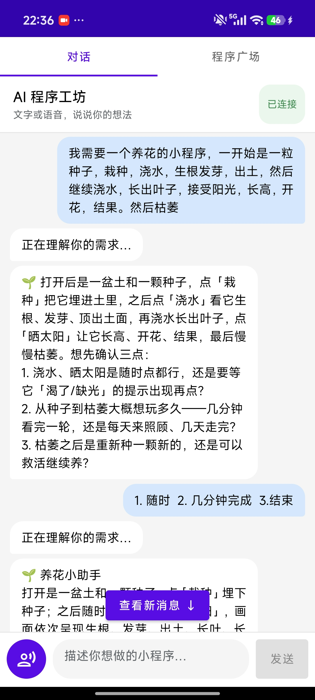
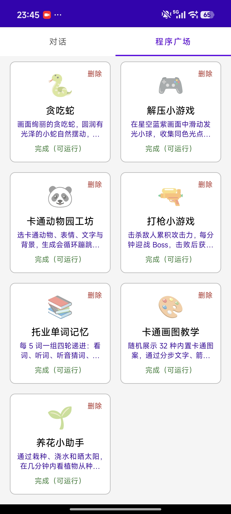
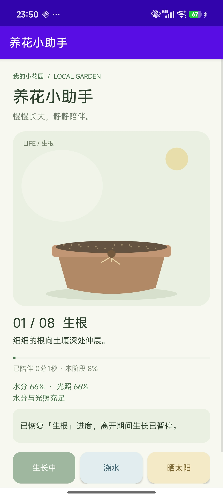

# 手机程序作坊

**中文** | [English](README.en.md)

用户以文字或语音说明所需功能。计算机端 Agent 评估可行性并给出方案；经用户确认后生成相应程序，作为插件下发至手机宿主应用中运行。本系统按个人需求单独制作，不提供面向大众的统一应用。

`data/` 为设计与契约基线，`code/` 为当前联调实现。二者对照阅读，即为完整说明。

---

## 主要功能介绍

| 能力 | 说明 |
|------|------|
| 诉求收集 | 对话页用文字或离线语音描述需求；手机不直连大模型 |
| 可行性分析 | 产品 Agent 分析诉求并优化设计；未确认不进入开发 |
| 在线制作 | 开发 Agent 判断设计能否实现并编写程序；测试 Agent 验证后方可下发 |
| 程序广场 | 下载、校验、安装后出现在列表；用户点开再加载，不自动启动 |
| 历史续作 | 继续、修改已有任务；在原源码上改，不因标题相似覆盖旧程序 |
| 断云可用 | 已装的纯本地插件可离线打开；离线不能生成新程序 |

当前开发默认是 **USB + `adb reverse` + 宿主进程内 APK 插件**。目标形态仍是手机只访问云侧 Agent HTTP API，插件默认走声明式 `.apkg`；USB 调试不是发布通道。

范围内：本地待办、打卡、清单、简单计算、问答记录、本地小游戏。  
范围外：相机、支付、任意网络、定位、联系人、通用 Android 工程生成。

---

## 使用示例

以「养花小助手」为例：收集诉求、对齐诉求，程序下载到程序广场，再打开运行。

| 收集与对齐诉求 | 下载到程序广场 | 运行程序 |
|:---:|:---:|:---:|
|  |  |  |

---

## 主要架构图

```text
用户（文字 / 语音）
        │
        ▼
┌─────────────────── 手机宿主 App ───────────────────┐
│  对话页          程序广场                           │
│  ASR 转文字  →  控制面 chat/job/report              │
│  下载校验    →  私有 files/plugins/                 │
│  点击加载    →  Runtime 或 DexClassLoader           │
└──────────┬──────────────────────────▲──────────────┘
           │ 手机 127.0.0.1:17890/17891 │
           │         adb reverse        │
           ▼                            │
┌─────────────────── 电脑 Agent ─────────────────────┐
│  ConnectPhone :17890     DownloadServer :17891     │
│           │                                        │
│           ▼                                        │
│  统筹 Agent：判定用户消息应交予哪一方              │
│    ├─ 产品 Agent：分析诉求，优化设计               │
│    ├─ 开发 Agent：判断设计能否实现，并开发         │
│    └─ 测试 Agent：测试方案是否按设计实现           │
└────────────────────────────────────────────────────┘
```

逻辑分层与 `data/01-overall-architecture.md` 一致：手机只连 Agent，不连模型；云侧（当前是本机进程）编排生成；端侧独立验包后再加载。

```text
UserRequest + Runtime 画像
  → 统筹分发
  → 产品：分析诉求，优化设计
  → 开发：判断能否实现，并开发
  → 测试：验证实现
  → 制品下发
  → 端侧校验 → 安装 → 激活 → 用户点击运行
```

仓库对应关系：

| 目录 | 角色 |
|------|------|
| `data/` | 架构、契约、安全、路线图 |
| `code/agent/` | PC 端 Agent |
| `code/phone_agent/` | 手机宿主 |
| `code/plugin_sdk/` | APK 插件入口契约 |
| `code/startServer/` | 联调启动：`adb reverse` + Agent |

---

## 1. 主要交互流程

用户始终停在自己选的页签。制作期间不强制切到程序广场。

```text
打开 App ──自动连电脑──► 对话页
        │
        ├─ 文字 / 语音 ──chat──► 统筹 Agent
        │                         ├─ 产品：分析诉求，优化设计
        │                         ├─ 开发：判断设计能否实现，并开发
        │                         └─ 测试：验证方案实现
        │                                  │
        │                         测试通过后才下发制品
        │                                  ▼
        │                         job: making → downloading
        │                                  ▼
        └─ HTTP 17891 流式下载 ──校验──► installing → ready
                                              │
                                              ▼
                                   程序广场出现卡片，用户点开
```

关键约束：

1. **未经确认不得发布。** 「好的把按键放大」是修改意见，不是开始制作。
2. **控制面不运整包。** `job` 只带描述符（大小、SHA-256、下载地址）；制品走 17891。
3. **云侧通过 ≠ 手机通过。** 端侧自己校验后再原子安装；失败不覆盖当前可用版本。
4. **已发布包不原地改。** 要改就带原任务开续作或新任务。

任务在用户侧的动作与 `data/01` 对齐：`approve` / `revise`（意见必填）/ `reject`（无意见再出一版，默认 ≤3）/ `cancel`。

当前联调状态机（APK 通道）为 `making → downloading → installing → ready | failed`。后两态由手机管理。

---

## 2. PC 端 Agent 设计

电脑侧按四个独立 Agent 分工。用户消息先由统筹 Agent 判定应交予哪一方；各方只处理本职，不改写其他 Agent 的结论。大模型仅在电脑侧调用。

入口：`code/agent/main.py`。日常启动：`cd code/startServer && ./start-adb-server.sh`。

### 2.1 四个 Agent

```text
手机消息
    │
    ▼
统筹 Agent ──判定交互对象──┐
    │                      │
    ├─ 产品 Agent          │ 分析诉求，优化设计
    ├─ 开发 Agent          │ 判断设计能否实现，并开发
    └─ 测试 Agent          │ 测试方案是否按设计实现
                           │
                           ▼
                    通过后注册制品并通知下载
```

| Agent | 职责 | 不负责 |
|------|------|------|
| 统筹 Agent | 判断用户消息应与哪个 Agent 交互，维护当前阶段 | 分析诉求、编写程序、判定测试是否通过 |
| 产品 Agent | 分析用户诉求，优化设计，形成可确认的方案 | 判断实现细节、编写程序 |
| 开发 Agent | 分析产品设计能否实现；能则开发并编译 | 自行改写产品诉求 |
| 测试 Agent | 依据产品设计与验收条件验证实现；通过后方可下发 | 修改需求或产品方案 |

产品设计归档于 `code/agent/out/tasks/<taskId>/product/`。开发与测试在任务目录内进行；失败时由统筹 Agent 交回对应一方处理，不整包重写，也不用无关程序顶替。

### 2.2 与现有代码的对应

| Agent | 现有落点 |
|------|------|
| 统筹 Agent | `orchestrator.py` |
| 产品 Agent | `apk_product_manager/` |
| 开发 Agent | `program_agent/` |
| 测试 Agent | 独立角色，由统筹在开发完成后调度 |
| 手机桥 / 下发 | `connect_phone/`、`apk_delivery.py`、`download_server.py` |

---

## 3. 手机端设计

工程：`code/phone_agent/`。首页两个页签：**对话**、**程序广场**。

可信的是已安装宿主、内置校验与 Runtime；不可信的是用户输入、模型输出和下载字节。手机不在本地调 LLM。

### 3.1 语音系统

离线、按住式、非流式 ASR，不使用 VAD。

| 项 | 实现 |
|----|------|
| 引擎 | Sherpa-ONNX `OfflineRecognizer` |
| 模型 | `assets/sherpa-onnx-paraformer-zh-2023-09-14/`（`asrModelType = 0`） |
| 采集 | 16 kHz 单声道 PCM；点开始缓冲，点结束整段转写 |
| 入口 | `PushToTalkAsr.kt`；首次点语音才申请麦克风 |
| 交互 | 录音显示波形；识别结果追加到输入框，可再编辑后发送 |
| 约束 | 仅 arm64 真机；切页、进后台、离开页面结束录音 |

语音只负责变成文字。发出去的仍是普通 `chat`，和手打输入同一条链路。文本对话不依赖 ASR 初始化完成。

### 3.2 端云交互

手机永远只连 Agent，不连 Ollama / 云模型 API。

**当前开发通道（USB）**

```text
App ──TCP──► 手机 127.0.0.1:17890 / 17891
                    │
               adb reverse
                    ▼
             电脑 Agent 监听同一端口
```

- 不必同一 Wi-Fi，也不必知道电脑局域网 IP。
- 控制面 17890：一行一条 UTF-8 JSON，`{"type":"...","text":"..."}`，单帧 ≤ 64 KiB。
- 制品面 17891：只读 HTTP，边下边限大小并算 SHA-256；写 `.part`，通过后再进安装。
- 应用层心跳：连接后先 `ping`/`pong`，之后每 5 秒探测，超时断线自动重连。TCP 连上不等于「已连接」。
- 重连后服务端重放最近任务；手动点「断开」才停止重试。

报文类型：`chat`（对话）、`job`（任务/制品描述符）、`artifact_report`（下载校验安装结果）、`runtime_error`（插件崩溃回传）、`ping`/`pong`（不进对话、不调模型）。

**目标生产通道**

手机走 HTTPS Task API 与短时 Download Ticket；Release 禁止回环下载。见 `data/04-api-and-package-spec.md`。USB Profile 只用于联调。

### 3.3 插件加载的几种方式

宿主要解决的是：程序在电脑上独立生成，下载到 App 私有目录后再跑，尽量不重装宿主。`data/07-host-process-plugin-architecture.md` 比较过下列路径。

| 方式 | 做法 | 本项目中的位置 |
|------|------|----------------|
| **A. 声明式 `.apkg` + 固定 Runtime** | 包内只有 JSON / 资源 / 测试 / 签名；宿主解释执行，不跑模型代码 | 安全默认通道。`--runtime declarative`。`PluginStore` + 内置组件表。上架版应走这条 |
| **B. 宿主进程 APK（PluginEntry）** | Gradle 独立编 `plugin.apk`，不调用系统安装器；点击后 `DexClassLoader` 加载，在宿主 Activity 里 `onCreate` | **当前 Debug 默认。** `PluginLoader` → `PluginContainerActivity`。可做 Canvas 小游戏 |
| **C. 旧 createView 反射入口** | `public View createView(Context)` | 兼容旧 APK。`ApkPluginActivity`。新生成插件统一用 B |
| D. H5 ZIP + WebView | 下发 HTML/JS | 比较过：适合不可信表单，交付不了原生 APK，未作主通道 |
| E. Play Dynamic Feature | 随 App Bundle 由 Play 下发 split | 比较过：必须走商店，不能给 Agent 现做的包用 |
| F. 独立安装 APK | PackageInstaller，新进程 | 明确不采用：那就不是宿主内插件 |
| G. Shadow / RePlugin 等 | hook 系统、代理 Activity | 比较过：过重、兼容性差，MVP 不用 |

当前默认加载路径（B）：

```text
17891 下载 → 大小 / SHA-256
  → 私有目录只读保存（须含 classes.dex，禁止 .so）
  → 广场卡片 ready
  → 用户点击
  → PluginLoader（仅 Debug）
  → DexClassLoader(apk, codeCacheDir, null, hostClassLoader)
  → PluginEntry.onCreate(host, container)
```

契约在 `code/plugin_sdk/`：插件只依赖 Android SDK，不依赖宿主私有类，不申请新权限，不带 native library，不应自行联网。加载或运行失败抓 `load` / `onCreate` / `runtime`，回传电脑侧按堆栈改源码再编，不在手机上执行修复。

安装、激活、会话三套状态分开：已下载 ≠ 已激活 ≠ 正在跑。默认 `autoInstall=true`、`autoActivate=true`、`autoLaunch=false`。

APK 通道的摘要校验还不是生产签名审核；伪造来源的包不得当作已发布能力。Google Play 上架版应关闭 B，只保留 A（或官方 Dynamic Feature）。

---

## 文档与代码索引

| 文档 | 内容 |
|------|------|
| [data/README.md](data/README.md) | 设计基线、术语、不可变原则 |
| [data/01-overall-architecture.md](data/01-overall-architecture.md) | 边界、主流程、状态机 |
| [data/02-agent-implementation-plan.md](data/02-agent-implementation-plan.md) | 云侧 / PC Agent 编排 |
| [data/03-demo-implementation-plan.md](data/03-demo-implementation-plan.md) | 手机宿主、预览、断云 |
| [data/04-api-and-package-spec.md](data/04-api-and-package-spec.md) | API 与包契约 |
| [data/05-security-and-verification.md](data/05-security-and-verification.md) | 信任边界与验包 |
| [data/07-host-process-plugin-architecture.md](data/07-host-process-plugin-architecture.md) | 插件加载方案比较 |
| [data/08-procedure-alignment-and-optimizations.md](data/08-procedure-alignment-and-optimizations.md) | 当前实现对齐与启动方式 |
| [data/11-phone-agent-chat-ui.md](data/11-phone-agent-chat-ui.md) | 对话页交互 |
| [code/startServer/README.md](code/startServer/README.md) | ADB 连接、心跳、排障 |
| [code/agent/program_agent/FRAMEWORK.md](code/agent/program_agent/FRAMEWORK.md) | APK 插件框架约定 |

契约变更先改 `data/04`，安全变更先改 `data/05`，再同步其余文档与 `code/`。
